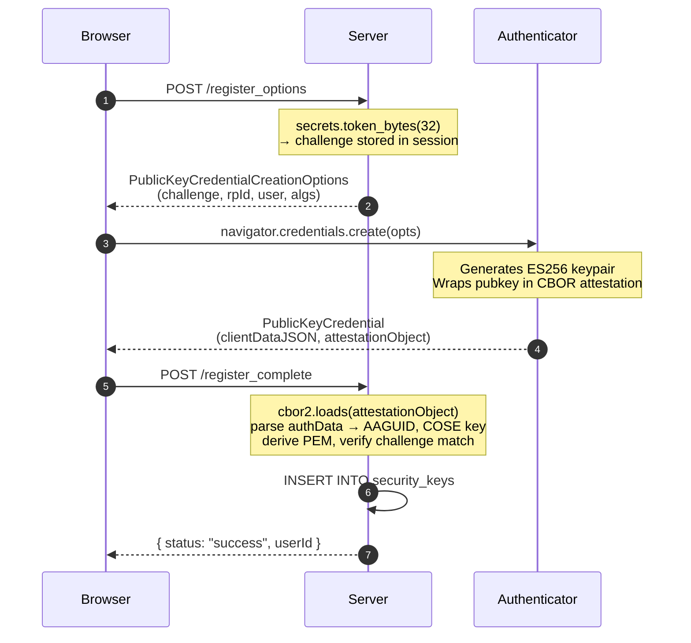
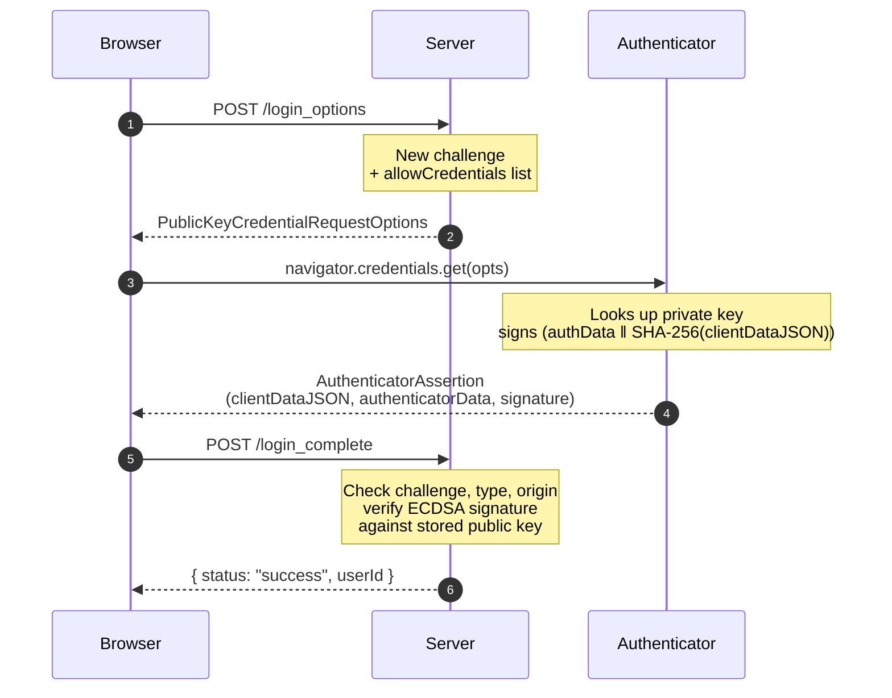

# Auth Chat

A passwordless real-time chat application built on FIDO2 / WebAuthn, designed to also serve as a **readable reference implementation** of the WebAuthn protocol. Includes a live `/demo` page that walks through a real registration + authentication round-trip and shows every byte on the wire — challenges, CBOR-decoded attestation objects, COSE public keys, signatures, and the server-side verification checks.

## Features

- **Hardware-bound authentication** — FIDO2 / WebAuthn with cross-platform attachment for the main app
- **Live WebAuthn walkthrough** at `/demo` — accepts any authenticator (security keys, Touch ID, Windows Hello, Android biometric); fully decodes every step; persists nothing
- **Public + private channels** — open read-only feed, gated send, and a private channel for verified members
- **Live location map** — opt-in real-time location sharing for authenticated users (Leaflet)
- **Anonymous identities** — generated handles, no PII collected
- **Per-endpoint rate limiting** and hardened session cookies (`Secure`, `HttpOnly`, `SameSite=Strict`)
- **Single-binary deploy** — Flask + SQLite, no external services required

## Tech Stack

- **Backend:** Python 3.8+, Flask, SQLite
- **Auth:** WebAuthn / FIDO2 (cross-platform attachment)
- **Crypto:** `cryptography` (ECDSA P-256, RS256), `cbor2` (attestation decoding)
- **Frontend:** Vanilla JavaScript, CSS (no build step)
- **Map:** Leaflet
- **Deploy:** Render.com / Heroku / self-hosted (Procfile + render.yaml included)

## How WebAuthn works in this codebase

WebAuthn replaces passwords with a public-key challenge–response: the user's authenticator (YubiKey, Touch ID, etc.) holds a private key and signs a server-issued challenge. The server stores only the public key. Every login is a fresh signature over a fresh random challenge — there's nothing replayable to steal.

The flow has two phases: **registration** (create a new keypair, give the server the public key) and **authentication** (sign a challenge with the existing private key). Both are implemented in `routes/auth.py`; the cryptographic helpers live in `webauthn_utils.py`.

### Registration



| Step | Code |
|------|------|
| Generate challenge & options | [`routes/auth.py:25`](routes/auth.py#L25) — `webauthn_register_options()` |
| Decode attestation, extract public key | [`webauthn_utils.py:148`](webauthn_utils.py#L148) — `extract_public_key_from_attestation()` |
| Parse AAGUID & flags from `authData` | [`webauthn_utils.py:36`](webauthn_utils.py#L36) — `extract_attestation_info()` |
| Verify and persist | [`routes/auth.py:105`](routes/auth.py#L105) — `webauthn_register_complete()` |

### Authentication



| Step | Code |
|------|------|
| Generate challenge & list known credentials | [`routes/auth.py:292`](routes/auth.py#L292) — `webauthn_login_options()` |
| Verify signature against stored public key | [`webauthn_utils.py:179`](webauthn_utils.py#L179) — `verify_authenticator_signature()` |
| End-to-end verification + session establishment | [`routes/auth.py:334`](routes/auth.py#L334) — `webauthn_login_complete()` |

### Try it live

The `/demo` page runs both phases against your real authenticator and renders a fully decoded breakdown of every payload:

- The 32-byte challenge in hex and base64url
- The full `PublicKeyCredentialCreationOptions` / `RequestOptions` JSON
- The CBOR-decoded `attestationObject` (fmt, attStmt, authData byte-by-byte)
- The COSE_Key parsed into `kty` / `alg` / `crv` / `x` / `y` and converted to PEM
- The ECDSA signature, the signed payload, and the per-check verification result

The demo writes nothing to the database. The credential lives only in the user's session for the duration of the walkthrough.

Implementation: [`routes/demo.py`](routes/demo.py), [`templates/demo.html`](templates/demo.html), [`static/demo.js`](static/demo.js).

### Design decisions

- **ES256 (alg `-7`) by default.** `pubKeyCredParams` lists ECDSA P-256 first; the demo also accepts RS256 for broader passkey compatibility.
- **`authenticatorAttachment: "cross-platform"` for the main app.** Forces hardware keys; rejects platform authenticators. The `/demo` flow drops this restriction so visitors without a YubiKey can still see the protocol end-to-end.
- **AAGUID-based platform-key blocklist.** Even with cross-platform attachment, some platform authenticators advertise as cross-platform — [`routes/auth.py:131`](routes/auth.py#L131) checks the AAGUID against a known blocklist as a defense in depth.
- **Discoverable credentials (`residentKey: "required"`).** Lets users sign in without first entering a username — the credential ID is discovered on the key itself.
- **`userVerification: "discouraged"`.** Trade-off: a touch is enough; no PIN required. Suitable for the trust model of this app.
- **No platform-specific WebAuthn library.** All decoding (CBOR, COSE → PEM, signature verification) is done with `cbor2` + `cryptography` directly — easier to read, no hidden behavior.

## Quick Start

### Prerequisites
- Python 3.8+
- A physical security key (YubiKey, Titan, etc.)
- A WebAuthn-capable browser (Chrome, Firefox, Edge, Safari 14+)

### Local development

```bash
git clone https://github.com/yourusername/render-authentication-project.git
cd render-authentication-project
pip install -r requirements.txt

export DEPLOYMENT_URL="http://localhost:5000"
python app.py
```

Then open `http://localhost:5000`.

### Configuration helper

```bash
python configure.py
```

Walks through generating a secret key and producing a `.env` for your target host.

## Deploy to Render

1. Push to GitHub and create a new Web Service on Render.
2. Set environment variables:
   - `SECRET_KEY` — generate with `python -c "import secrets; print(secrets.token_hex(32))"`
   - `DEPLOYMENT_URL` — your Render URL
   - `DB_PATH` — `/opt/render/webauthn.db`
3. Deploy.

See [DEPLOYMENT_GUIDE.md](DEPLOYMENT_GUIDE.md) for Heroku and self-hosted instructions.

## Configuration

All configuration is environment-variable driven:

| Variable | Default | Description |
|----------|---------|-------------|
| `DEPLOYMENT_URL` | — | Public URL of the deployment (required for WebAuthn origin check) |
| `SECRET_KEY` | — | Flask session encryption key |
| `DB_PATH` | `./webauthn.db` | SQLite database path |
| `MAX_USERS` | `25` | Maximum registered users |

### Theming

CSS variables live at the top of `static/style.css`:

```css
:root {
    --bg-primary: #0f172a;
    --bg-secondary: #1e293b;
    --accent: #10b981;
    --accent-hover: #34d399;
    --text-primary: #f1f5f9;
    /* ... */
}
```

## Architecture

```
.
├── app.py                 # Flask entrypoint, blueprint registration
├── routes/
│   ├── auth.py            # WebAuthn register / login / logout
│   ├── chat.py            # Public + private message endpoints
│   ├── demo.py            # Ephemeral /demo walkthrough endpoints
│   ├── map.py             # Location sharing endpoints
│   ├── admin.py           # Registration toggle, debug
│   └── pages.py           # Template routes
├── webauthn_utils.py      # FIDO2 challenge / verification helpers
├── db_utils.py            # SQLite schema + connection
├── static/
│   ├── webauthn.js        # WebAuthn client
│   ├── demo.js            # /demo orchestration + decoded-payload renderer
│   ├── publicchat.js      # Public chat polling + render
│   ├── privatechat.js     # Private chat polling + render
│   ├── map.js             # Leaflet integration
│   └── style.css          # Slate + emerald theme
└── templates/
    ├── index.html         # Chat
    ├── demo.html          # Live WebAuthn walkthrough
    ├── map.html           # Live map
    ├── admin.html         # Admin controls
    └── info.html          # About / docs
```

### Database

Three tables, created on first run:

- `security_keys` — credential ID, user ID, public key, AAGUID, handle
- `messages` — public chat
- `private_messages` — gated chat

### Security

- WebAuthn cross-platform attachment only (rejects platform/phone authenticators)
- HTTPS-only session cookies, `SameSite=Strict`
- Per-endpoint rate limiting
- No password storage — credentials are public-key only
- Output sanitization on user-supplied content (incl. image URLs)

## Usage

### First user
1. Visit the deployment.
2. Click **Register New Key**, insert your security key, touch to confirm.
3. The first registered user becomes the admin.

### Returning users
1. Click **Login with Security Key**.
2. Insert the same key and touch to authenticate.

### Reset

```bash
sqlite3 /path/to/webauthn.db
sqlite> DELETE FROM security_keys;
sqlite> DELETE FROM messages;
sqlite> DELETE FROM private_messages;
```

## Troubleshooting

- **"Registration closed"** — increase `MAX_USERS` or remove unused entries from `security_keys`.
- **Security key not detected** — WebAuthn requires HTTPS and a supported browser.
- **"Origin mismatch"** — make sure `DEPLOYMENT_URL` matches the actual served origin.
- **Messages not loading** — check the browser console and server logs; verify the DB path is writable.

See [DEPLOYMENT_GUIDE.md](DEPLOYMENT_GUIDE.md) for more.

## License

Free to use, modify, and deploy.
